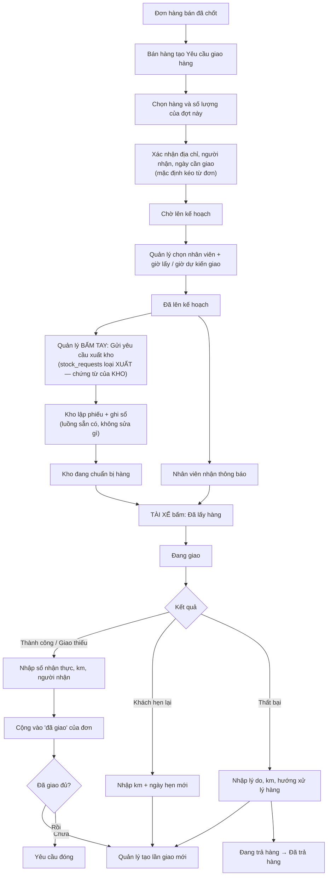

# PRD — Kế hoạch giao hàng & Giao hàng

> 📄 **Đọc kèm `prd-giao-hang-mot-yeu-cau-mot-chuyen.md`** — bản đó thay §7 · §9 và ba dòng của §12 kể từ 22/08/2026.

> Trạng thái: **ĐÃ LÀM 19/08/2026** — backend + frontend + 32 test nghiệm thu.
> Thiết kế chốt 19/08/2026; phần thực thi bám sát, chỗ nào lệch đã ghi ngay tại mục đó.
> Bản này giữ nguyên khung PRD gốc (§1–§12) và bổ sung bốn phần mà bản gốc chưa có: dữ liệu,
> phân quyền, migration, và danh sách **cố ý không làm**.

---

## 0. Sáu quyết định đã chốt (đọc trước, đừng lật lại)

Ghi ra đây kèm LÝ DO, vì cả sáu cái đều có phương án khác nghe cũng hợp lý — sáu tháng nữa không
có lý do thì sẽ có người "sửa cho đúng" rồi làm vỡ.

| # | Quyết định | Vì sao |
|---|---|---|
| 1 | **Không chặn khi hàng chưa sản xuất xong** — chỉ hiện trạng thái LSX cho quản lý tự nhìn | `lsx.trang_thai` dừng ở `da_phat_hanh` (`backend/app/models/lsx.py:44-49`), hệ **không có** dữ liệu "hàng đã xong / đạt KCS". Chặn bằng dữ liệu không tồn tại là chặn bằng niềm tin. Thêm trạng thái hoàn thành cho LSX = đụng module Sản xuất đang có dữ liệu sống ⇒ để lượt sau |
| 2 | **Tài xế = `employees`**, không dựng bảng `drivers` | Hồ sơ NV đã có, `user_id` đã nối tài khoản đăng nhập. Trạng thái *"đang nghỉ"* ở §6 chỉ đọc được nếu tài xế là nhân viên thật (đơn nghỉ đã duyệt + chấm công hôm nay). Bảng riêng ⇒ phải khai tay lịch nghỉ lần hai |
| 3 | **Số km chỉ để thống kê, KHÔNG vào lương** | Engine lương vừa rà xong 15–18/08/2026. Nối thêm một nguồn phụ cấp vào lúc này là mở mặt trận mới. Muốn tính phụ cấp theo km thì làm sau, khi đã có số thật vài tháng |
| 4 | **Trạng thái đặt ở LẦN GIAO**, trạng thái của Yêu cầu là hàm — không lưu | Lưu hai chỗ là hai chỗ lệch nhau. Và §9 (giao lại) không cài được nếu trạng thái nằm ở yêu cầu: lần 1 thất bại + lần 2 thành công thì yêu cầu mang trạng thái nào? |
| 5 | **"Đã giao bao nhiêu" là `SUM` từ các lần giao thành công**, không thêm cột `delivered_qty` | Repo không có Alembic. Cột cộng dồn lệch một lần là không có đường phát hiện, cũng không có đường sửa lại êm |
| 6 | **Giao hàng lập ĐÚNG một `stock_requests` loại XUẤT — chứng từ của KHO, không dựng loại riêng** | Hàng ra khỏi kho phải có phiếu kho; giao khách không ngoại lệ. Kho lập phiếu · ghi sổ · trừ tồn bằng luồng sẵn có, **không một dòng code nào bên kho bị sửa**. Nối bằng soft-ref `stock_requests.delivery_trip_id` (mg 0201), cùng khuôn `purchase_delivery_id` của Mua hàng. Đổi lại: thành phẩm phải khai ở **Giấy / Vật tư khác** rồi nhập kho lấy số lượng — đúng quy trình xưởng đang chạy sẵn |

> **Quyết định #6 đã bị LẬT NGƯỢC ba lần trước khi đúng (19/08/2026).** Ba bản sai, mỗi bản
> sai một kiểu, và cả ba đều do tôi lách chứ không phải do ràng buộc:
>
> 1. **Tự sinh chứng từ** lúc lưu kế hoạch — xếp lịch và xin xuất hàng là hai việc khác nhau.
> 2. **Dựng bảng `delivery_issue_requests` song song** kèm nút *Duyệt* cho kho — trong khi kho
>    **không có bước duyệt** (bỏ từ 06/08/2026: *"tạo yêu cầu là duyệt luôn"*), họ **lập phiếu**.
> 3. **Bỏ hẳn phiếu**, lấy cớ *"thành phẩm không có trong danh mục nên không lập phiếu kho được"*.
>
> Cớ ở (3) sai vì tôi không hỏi: xưởng **vẫn đang** khai sản phẩm ở Giấy / Vật tư khác rồi vào kho
> nhập số lượng. Đường đã có sẵn. Tôi còn dùng một con số phóng đại để chống chế — nói *"205 chỗ
> đọc `hang_loai`"* trong khi chỉ **13** chỗ so sánh và **1** chỗ so với chuỗi cụ thể.
>
> Bài học: **ràng buộc kỹ thuật là thứ phải vượt, không phải cớ để bỏ luật nghiệp vụ.** Và trước
> khi nói "không làm được", hỏi người dùng xem họ đang làm bằng cách nào.

**Hệ quả của #2 — ĐÃ LÀM 19/08/2026:** `backend/app/ports/driver_delivery_port.py` chờ một phân
hệ **Tài xế** mà ta quyết định không dựng ⇒ đã **xoá**, cùng `tests/test_seam_driver_delivery.py`.
Không có nơi nào gọi (đã grep toàn repo). Số hiệu `SEAM-25` mà file đó tự nhận là **trùng**:
`docs/CROSS_MODULE_LINKS.md` đã cấp 25 cho seam Thu mua→Kế toán (đã đóng 10/07/2026), nên không có
dòng registry nào phải sửa.

---

## 1. Mục tiêu

Quản lý toàn bộ quá trình giao hàng từ lúc Bán hàng gửi yêu cầu, bộ phận Giao hàng lên kế hoạch,
phân công nhân viên, theo dõi kết quả và ghi nhận quãng đường thực tế.

Mỗi **Yêu cầu giao hàng** là một đợt giao của một **Đơn hàng bán**. Một đơn hàng có thể phát sinh
nhiều yêu cầu.

## 2. Phạm vi phiên bản đầu

**Bao gồm**

- Bán hàng tạo Yêu cầu giao hàng từ Đơn hàng bán đã chốt.
- Theo dõi số lượng đã yêu cầu · đã giao · còn lại.
- Danh sách yêu cầu chờ lên kế hoạch.
- Phân công nhân viên giao hàng; theo dõi rảnh / có lịch / đang giao / nghỉ.
- **Gửi Yêu cầu xuất kho** (chứng từ của KHO) khi lên kế hoạch; kho lập phiếu · ghi sổ như mọi
  phiếu vật tư khác.
- Nhân viên xác nhận lấy hàng và kết quả giao.
- Giao thành công · **giao thiếu** · giao thất bại · **khách hẹn lại** · hàng trả lại.
- Ghi nhận số kilomet thực tế từng lần giao.
- Lịch sử trạng thái + người thao tác.
- Thông báo nội bộ thời gian thực.

**Chưa bao gồm** *(ghi rõ để khỏi ai tưởng quên — xem thêm §16)*

- Ghép nhiều yêu cầu vào cùng một chuyến.
- GPS, tự động tính kilomet, tối ưu tuyến.
- Chi phí xăng xe, phí ship tính vào giá thành job.
- **Đổi / trả hàng SAU KHI đã giao thành công** — đụng công nợ và hoá đơn đã xuất, là một bài
  riêng. Trả hàng ở bản này chỉ là hệ quả của một lần giao thất bại.
- **Trạng thái hoàn thành / KCS cho Lệnh sản xuất** (quyết định #1).

## 3. Vai trò — và ô quyền tương ứng

Vai ngoài đời chỉ có nghĩa khi buộc được vào ô quyền thật; xem §14 cho ma trận đầy đủ.

**Bộ phận Bán hàng** — `giao_hang`: Xem + Thao tác, phạm vi **Của tôi**

- Tạo Yêu cầu giao hàng từ Đơn hàng bán đã chốt (nút nằm **trên màn Đơn hàng bán**).
- Chọn sản phẩm và số lượng cần giao đợt này.
- Theo dõi tiến độ giao của đơn mình phụ trách; nhận thông báo khi giao xong hoặc thất bại.
- Chỉ sửa / huỷ yêu cầu khi **chưa có lần giao nào**.

**Quản lý Giao hàng** — `giao_hang`: Xem + Thao tác + **Lên kế hoạch** + **Nhân viên giao hàng** +
Huỷ, phạm vi **Cả phòng** hoặc **Tất cả**

- Xem mọi yêu cầu Bán hàng gửi sang; xem tình trạng và lịch của nhân viên giao hàng.
- Lên kế hoạch, phân công, điều chỉnh **trước khi nhân viên bấm đã lấy hàng**.
- Tạo lần giao lại khi lần trước thất bại hoặc khách hẹn lại.

**Nhân viên Giao hàng** — `giao_hang`: Xem + Thao tác, phạm vi **Của tôi**

- Chỉ thấy kế hoạch phân công cho mình (đây chính là nghiệm thu #5 — do **phạm vi** lo, không phải
  code riêng).
- Xác nhận đã lấy hàng → Đang giao → nhập kết quả + số km + người nhận / lý do.

**Bộ phận Kho** — ô quyền `kho` sẵn có, **không cần cấp thêm ô `giao_hang`**

- **Kho không phải học gì mới, và màn Kho không bị sửa một dòng nào.** Yêu cầu của Giao hàng
  hiện trong **Hộp yêu cầu** như mọi yêu cầu xuất khác; kho **lập phiếu · ghi sổ** y hệt.
- **Kho KHÔNG đụng gì trên màn Giao hàng.** Việc *hàng đã tới tay tài xế chưa* do TÀI XẾ tự bấm —
  người cầm hàng mới là người biết.

**Quản trị viên** — phạm vi **Tất cả** + đủ ô chi tiết. Cấp quyền cho ba vai trên.

## 4. Luồng nghiệp vụ



> **Mặt hàng kho — xem `prd-thanh-pham.md`.** Người lập yêu cầu giao KHÔNG chọn mặt hàng: sản
> phẩm in là hàng đặt riêng, không có sẵn ở danh mục nào để mà chọn. Chốt đơn là hệ tự khai vào
> danh mục **Thành phẩm** (mã `TP-<số đơn>-<id dòng>`), kho nhập kho ở đó, rồi yêu cầu xuất kho
> của chuyến suy thẳng ra từ dòng yêu cầu giao. Bản trước bắt chọn tay — sai, sửa 19/08/2026.

## 5. Yêu cầu giao hàng

**Thông tin lưu**

- Mã tự sinh `YCGH-260812-A1B2` — cùng khuôn `YCMH-` bên Thu mua
  (`backend/app/services/purchase_service.py:1203`).
- Đơn hàng bán nguồn · Khách hàng · Ngày cần giao.
- Địa chỉ giao · Người nhận · SĐT người nhận · Ghi chú giao hàng.
- Danh sách sản phẩm + số lượng đợt này.
- Người tạo · thời gian tạo · trạng thái.

**Địa chỉ và người nhận: CHỌN, không gõ lại**

Đơn hàng bán đã giữ sẵn `delivery_committed_date` · `delivery_address` · `delivery_contact_name` ·
`delivery_contact_phone` · `delivery_note` (`backend/app/models/order.py:141-147`), và khách hàng
có hẳn sổ địa chỉ nhiều dòng (`customer_addresses`, `backend/app/models/customer.py:147`).

⇒ Màn tạo yêu cầu **điền sẵn** từ đơn, cho đổi bằng cách chọn địa chỉ khác trong sổ, sửa tay được.
Bắt gõ lại bốn ô đó vừa tốn thao tác vừa đẻ hai bản địa chỉ lệch nhau — lúc giao sai thì không biết
tin bản nào.

Giá trị sau khi xác nhận được **COPY vào yêu cầu** (snapshot), không đọc-sống từ đơn: sửa địa chỉ
đơn tháng sau thì phiếu giao cũ vẫn phải giữ địa chỉ đã giao thật. Cùng khuôn `unit_price_snapshot`
bên đơn hàng.

**Chọn hàng: TÍCH TỪNG DÒNG, không kéo cả đơn**

Đơn hai sản phẩm mà mới xong cái thứ nhất là chuyện thường ngày ⇒ phải giao được riêng dòng đó.
Mỗi dòng còn phải giao có một ô tích; tích vào thì điền sẵn **toàn bộ phần còn lại** (ca hay gặp
nhất), muốn giao ít hơn thì sửa số. Dòng chưa tích bị khoá ô số. Chưa tích dòng nào thì nút *Gửi*
mờ đi.

Ô số lượng là `type="number"` có `min`/`max`, **không phải** `inputMode="numeric"` — `inputMode`
chỉ đổi bàn phím trên điện thoại, bàn phím máy tính vẫn gõ chữ vào được.

**Quy tắc**

- Chỉ tạo từ đơn `ordered` (đã chốt — `backend/app/models/order.py:64`) và chưa giao đủ.
- **Không được yêu cầu vượt số còn phải giao** = `order_lines.qty` − đã giao − đang có yêu cầu mở.
- Ngày cần giao ở quá khứ ⇒ **CHẶN CỨNG**, không cho lưu. Chặn ở **cả hai cửa**: lúc lập và lúc
  sửa yêu cầu (`DeliveryService._chan_ngay_qua_khu`) — chặn một cửa mà để hở cửa kia thì coi như
  không chặn. Giao diện thêm `min` trên ô ngày + khoá nút Gửi, nhưng máy chủ mới là hàng rào thật
  (gõ tay vẫn lọt qua `min`).

  > **Sửa 20/08/2026.** Bản đầu chỉ *cảnh báo, vẫn cho lưu*, viện lý do "nhập bù đơn hôm qua là
  > chuyện thật". Chủ dự án bác: *"nay ngày 20 tôi lập phiếu yêu cầu thì sao mà chọn được ngày 19"*.
  > Đúng — yêu cầu giao là việc **sắp làm**, không phải sổ ghi việc đã làm: hàng chưa ra khỏi kho
  > thì không có gì để nhập bù. Ngày quá khứ ở đây chỉ có thể là gõ nhầm, mà gõ nhầm kéo lệch cả
  > hàng chờ giao lẫn thống kê trễ hạn.

  Ranh giới là **trước hôm nay**, KHÔNG phải "từ mai": giao trong ngày là ca hay dùng nhất.

- **Giờ lấy hàng · giờ dự kiến giao cũng chặn quá khứ** (20/08/2026), dung sai 5 phút — người xếp
  lịch chọn "14:00" rồi còn gõ ghi chú, không có dung sai là chặn oan đúng ca hay gặp nhất.

  ⚠️ Chặn trên **giá trị người dùng vừa gửi**, KHÔNG trên giá trị đã gộp. Chỗ kiểm đúng là
  `len_ke_hoach` / `doi_ke_hoach`; đặt vào `kiem_lich_tai_xe` (hàm dùng chung) là **sai** — lúc
  đổi, hàm đó nhận giờ CŨ của chuyến, nên chuyến xếp từ hôm qua không đổi nổi tài xế. Đã cắn
  đúng vậy 20/08/2026.

- **Kho lập phiếu ⇒ chuyến hiện "Kho đã chuẩn bị xong"** (20/08/2026). SUY RA từ `stock_vouchers`
  của yêu cầu kho, **không phải cột lưu** — kho thao tác trên màn của HỌ và không bấm gì trên màn
  Giao hàng, nên một cột lưu ở đây sớm muộn lệch với sổ kho. Cùng luật với *"đã giao = tổng số
  thực nhận"*.

  Mốc là **lập phiếu**, KHÔNG phải ghi sổ: lập phiếu nghĩa là kho đã soạn hàng và viết chứng từ,
  tài xế tới lấy được. Ghi sổ (`REQ_DONE`) chỉ đến sau khi hàng đã ra khỏi kho — lúc đó thì muộn.
  Phiếu đã huỷ không tính.

---

### Real-time cho TÀI XẾ (20/08/2026)

Phân hệ này trước đó **không đẩy một sự kiện nào** — trái luật sản phẩm ở CLAUDE.md. Tài xế đang ở
kho hoặc trên đường, bắt họ F5 để biết *"kho soạn xong chưa"* là bắt đoán: đoán sai thì hoặc tới
sớm ngồi chờ, hoặc tới muộn.

Bốn mốc đẩy **đích danh** cho tài xế của chuyến (`hub.publish(user_id, …)`, type `giao_hang_chuyen`):

| Mốc | `viec` | Ai bấm |
|---|---|---|
| Phân chuyến | `phan_chuyen` | Quản lý — lên kế hoạch, hoặc đổi sang tài xế khác |
| Đổi giờ chuyến | `doi_gio` | Quản lý |
| Gửi yêu cầu xuất kho | `gui_kho` | Quản lý |
| **Kho lập phiếu** | `kho_xong` | **Kho** — mốc tài xế lên đường |

⚠️ Mốc cuối là **móc duy nhất Giao hàng đặt vào luồng Kho**. Toàn bộ logic ở
`services/delivery_notify`; `routers/kho_voucher` chỉ có MỘT dòng gọi và hàm đó **tự nuốt lỗi** —
hỏng gửi toast không được làm hỏng việc lập phiếu. Chỉ đọc, không sửa gì của kho.

Tài xế thường **chỉ có ô `giao_hang`**, nên cổng mở SSE ở `AppShell` phải kể tên module đó —
thiếu thì họ không kết nối và mọi thông báo rơi vào hư không.

### Ai là tài xế — theo BỘ PHẬN (20/08/2026)

`departments.la_giao_hang` (mg 0205), cùng luật kế thừa cây con với `la_san_xuat`/`la_kinh_doanh`,
công tắc thứ ba trên dialog Phòng ban.

Trước đó tab Nhân viên lọc theo **quyền RBAC** rồi **bỏ qua ai chưa có chuyến** — tài xế mới tuyển
không hiện ra, mà không hiện thì không ai phân chuyến cho họ được. Vẫn **giữ** người đã có chuyến
dù phòng chưa tick cờ: dữ liệu cũ khai trước khi có cờ, lọc thẳng tay là chuyến đang chạy biến mất
khỏi bảng điều độ.

**MỘT luật, hai nơi dùng** (`_ai_la_tai_xe`): ô **chọn tài xế** lúc lên kế hoạch và tab **Nhân
viên** phải trả cùng một danh sách. Trước 20/08/2026 hai chỗ trả lời khác nhau — tab lọc theo BỘ
PHẬN, ô chọn lọc theo QUYỀN RBAC — nên ô chọn mời cả Admin lẫn thủ kho, tài xế thật lẫn giữa họ.

* **Chưa tick phòng nào** ⇒ lùi về luật cũ (có tài khoản mở được màn Giao hàng). Trả rỗng ở đây là
  không ai phân chuyến được nữa.
* **KHÔNG loại người chưa có tài khoản.** `da-lay-hang` / `ket-qua` gác bằng ô **Thao tác** nên
  quản lý bấm hộ được — chuyến không tắc. Chỉ đánh dấu `co_thao_tac` để người phân công biết ai
  tự bấm được.

⚠️ `_khoi_theo_co` trả **danh sách Department**, không phải tập id — quên rút `.id` thì phép so
`department_id not in <list>` LUÔN đúng và loại hết mọi người, im lặng. Đã cắn 20/08/2026.

### KM — hai cột, hai khung thời gian

`Km hôm nay` để **điều độ** (giờ ai đang rảnh) · `Km tháng này` để **theo dõi định kỳ**. Hai câu
hỏi khác nhau nên hai hàm (`thong_ke_ngay` / `thong_ke_thang`), không gộp một hàm có cờ — gộp thì
nơi gọi phải nhớ cờ nghĩa là gì.

Km vẫn **CHỈ để thống kê, không vào lương** (quyết định #3 giữ nguyên).
- Một yêu cầu thuộc đúng một đơn hàng, không ghép với yêu cầu khác.
- Sửa / huỷ: chỉ khi **chưa có lần giao nào**. Đã lên kế hoạch thì phải huỷ kế hoạch trước.
- **Đơn hàng bán không chuyển sang `cancelled` được khi còn yêu cầu giao chưa đóng** — báo lỗi phải
  nêu đúng mã `YCGH-…` đang mở, đừng bắt người ta đi mò.

## 6. Lên kế hoạch giao hàng

Quản lý chọn một yêu cầu và nhập: **nhân viên giao** · **giờ lấy hàng** · **giờ dự kiến giao** ·
ghi chú phân công.

> **Tài xế CHỌN trong danh sách, không gõ mã.** Gõ mã thì sai một chữ số là phân công nhầm người
> mà không có gì báo. Danh sách đi qua đường riêng `GET /api/giao-hang/tai-xe-chon` gác bằng ô
> **Lên kế hoạch** — KHÔNG dùng `/api/employees` vì đường đó gác bằng ô `nhan_su`, mà bắt Quản lý
> Giao hàng cấp thêm `nhan_su` chỉ để chọn tài xế là mở toang hồ sơ nhân sự cả công ty. Roster chỉ
> trả id · mã · họ tên · phòng. Hệ đã làm y khuôn này cho màn Đi muộn / về sớm.

**Trạng thái nhân viên — hệ thống tự tính, không cho nhập tay**

| Hiện | Tính từ |
|---|---|
| Nghỉ | Đơn `nghi_phep` **đã duyệt** phủ ngày đó |
| Đang giao | Có lần giao đang ở trạng thái *Đang giao* |
| Có lịch | Có lần giao *Đã lên kế hoạch* trong ngày |
| Đang trả hàng | Có lần giao ở trạng thái *Đang trả hàng* |
| Rảnh | Không rơi vào bốn ca trên |

Neo vào `nghi_phep` / `cham_cong` chứ **đừng đẻ một ô khai tay thứ hai** — đó đúng cái bệnh "ô cấu
hình giả" mà đợt phân quyền 15–18/08/2026 vừa dọn.

**"Trùng lịch" nghĩa là gì — phải định nghĩa mới test được**

Hai lần giao của **cùng một nhân viên** là **TRÙNG** khi hai khoảng
`[giờ lấy hàng → giờ dự kiến giao]` **giao nhau**.

- Trùng ⇒ **CHẶN**, không cho lưu, nêu rõ mã chuyến đang vướng.
- Không trùng nhưng **cách nhau dưới 30 phút** ⇒ **CẢNH BÁO**, vẫn cho lưu.

Bản gốc viết *"cảnh báo và không cho lưu"* — hai vế đá nhau. Và chặn cứng cả ca sát giờ sẽ vỡ ngoài
đời: giao gấp, đổi tài xế phút chót là chuyện thường ngày.

Một nhân viên được nhiều chuyến trong ngày miễn không trùng.

**Gửi Yêu cầu xuất kho — BẤM TAY, và là chứng từ CỦA KHO**

> **Sửa 19/08/2026, lần thứ ba.** Bản đầu tự sinh chứng từ lúc lưu kế hoạch. Bản hai dựng bảng
> `delivery_issue_requests` song song kèm nút *Duyệt* riêng cho kho. Cả hai đều sai: hàng ra khỏi
> kho phải có **phiếu kho**, và kho **không có bước duyệt** — họ **lập phiếu**.

- Lên kế hoạch xong, chuyến ở *Đã lên kế hoạch*. Quản lý bấm **Gửi yêu cầu xuất kho** trên chính
  dòng chuyến ⇒ tạo **một `stock_requests` loại XUẤT** qua đúng service của kho.
- Form giống hệt màn xin xuất vật tư: chọn **kho** + **mặt hàng trong danh mục** + đơn vị + số
  lượng. Mọi luật của kho áp y hệt — kể cả luật siết 08/08/2026 *"mặt hàng phải có thật trong danh
  mục"*. Không có cửa sau cho giao khách.
- **Không có bước duyệt.** `StockRequestService.create()` duyệt luôn (bỏ bước duyệt 06/08/2026),
  nên kho thấy là lập phiếu được ngay. Chuyến sang *Kho đang chuẩn bị hàng*.
- **Một chuyến chỉ một yêu cầu xuất kho.** Gửi lần hai bị chặn.
- Đổi giờ sau khi đã gửi ⇒ **CẢNH BÁO**, KHÔNG tự huỷ phiếu bên kho. Đó là chứng từ của họ; huỷ hộ
  là đụng vào sổ sách bên đó. Quản lý tự vào màn Kho huỷ nếu cần.
- Kho gửi tới chọn trong danh mục `kho_hang` — nhà máy khai một dòng *"Kho thành phẩm"*. Đây là
  **cấu hình, không phải code**.

- **Chuyến nào cũng qua kho — không có lối tắt.** Chuyến hỏng thì hàng về kho ngay chuyến đó; chuyến
  sau lấy hàng lại từ kho như bình thường. Một đường duy nhất, không rẽ nhánh, và **không có hàng
  nằm trên xe qua đêm mà không ai ghi sổ**.
- Kho gửi tới là kho chọn trong danh mục `kho_hang` — nhà máy khai một dòng *"Kho thành phẩm"*.
  Đây là **cấu hình, không phải code**.
- Đổi kế hoạch (đổi người / đổi giờ) khi kho **chưa** tiếp nhận ⇒ cập nhật đề nghị. Kho **đã** bắt
  đầu chuẩn bị ⇒ huỷ đề nghị cũ và sinh cái mới, để kho không chuẩn bị nhầm theo giờ cũ.

## 7. Trạng thái — HAI TẦNG

> ⚠️ **THAY BỞI `prd-giao-hang-mot-yeu-cau-mot-chuyen.md` §2.1 (22/08/2026).**
> Một yêu cầu nay chỉ có MỘT chuyến, nên hai tầng gộp về một. Bỏ `hen_lai`; `lan_thu` ngưng dùng.
> Phần dưới giữ lại để hiểu **vì sao** từng tách hai tầng — đừng dựng lại theo nó.

Bản gốc gộp 10 trạng thái vào một danh sách, nhưng chúng thuộc hai thực thể khác nhau. Tách ra:

**Yêu cầu giao hàng** — chỉ hai trạng thái nó thật sự sở hữu

| Trạng thái | Khi nào |
|---|---|
| `cho_len_ke_hoach` | Vừa tạo, chưa có lần giao nào |
| `da_huy` | Bị huỷ (chỉ huỷ được khi chưa có lần giao) |

Mọi thứ khác là **HÀM**, không lưu: có lần giao đang chạy ⇒ *Đang thực hiện*; `SUM` số đã giao đạt
số yêu cầu ⇒ *Đã giao đủ*. Lưu thành cột là tạo ra chỗ thứ hai để lệch.

**Lần giao (trip)** — bảy trạng thái, khớp đúng flowchart §4

```
da_len_ke_hoach → dang_chuan_bi → da_lay_hang → dang_giao → thanh_cong
                                                          → giao_thieu
                                                          → hen_lai
                                                          → that_bai → dang_tra_hang → da_tra_hang
```

**`Đang chuẩn bị hàng` và `Chờ lấy hàng` GIỮ NGUYÊN như bản gốc**, và mỗi cái có dữ liệu thật đứng
sau — chính là Đề nghị xuất hàng ở §6:

| Trạng thái | Ai chuyển | Dữ liệu đứng sau |
|---|---|---|
| `dang_chuan_bi` | **Quản lý** bấm *Gửi yêu cầu xuất kho* | `stock_requests` XUẤT được tạo (đã duyệt sẵn) |
| `da_lay_hang` | **Tài xế** tự bấm khi đã cầm được hàng | đòi chuyến đang ở `dang_chuan_bi` |

> **`cho_lay_hang` ĐÃ BỎ (19/08/2026).** Nó cần kho báo *"đã soạn xong"*, mà kho chỉ duyệt rồi
> thôi. Không ai bấm thì trạng thái đó chỉ là chữ trên màn — đúng lý do đã bỏ *Đang chuẩn bị hàng*
> ở bản nháp đầu, nay áp cho chính nó.

**Không có lối tắt.** Mọi lần giao đều đi đủ bảy trạng thái này, kể cả lần giao lại sau một chuyến
hỏng — vì hàng đã về kho ở chuyến trước (§6), và chuyến mới phải gửi đề nghị xuất hàng mới.

> **Ghi chú sửa đổi 19/08/2026.** Bản nháp đầu của PRD này đã **xoá nhầm** hai trạng thái trên với
> lý do "không có vai nào bấm, không có dữ liệu đứng sau". Lý do đó sai vì bản nháp bỏ sót thủ tục
> xuất kho: kho không cho hàng ra cửa nếu không có giấy. Giữ ghi chú này để lần sau đừng ai xoá lại.

**Mỗi lần đổi trạng thái lưu:** trạng thái trước → sau · người thao tác · thời gian · ghi chú · lý
do (bắt buộc khi thất bại / trả hàng / huỷ).

## 8. Xác nhận kết quả giao

**Thành công** — bắt buộc: số km · thời gian hoàn thành · người nhận hàng.
Tuỳ chọn: ảnh / biên nhận · ghi chú.

**Giao thiếu** — bắt buộc thêm: **số lượng thực nhận từng dòng hàng**.
Đây là ca hay gặp nhất ngoài đời (yêu cầu 100, khách nhận 60) mà bản gốc không có chỗ ghi. Phần
chưa nhận ở lại "còn phải giao", quản lý tạo lần giao mới.

**Khách hẹn lại** — bắt buộc: số km · ngày hẹn mới. Không phải thành công, cũng không phải thất bại.

⚠ *Khách hẹn lại* nghĩa là **hẹn sang buổi/ngày khác** ⇒ đóng chuyến, **hàng về kho**. Khách bảo
*"hai tiếng nữa quay lại"* thì **KHÔNG bấm gì cả** — chuyến vẫn đang chạy, tài xế đi việc khác rồi
quay lại. Phân biệt này quan trọng: không có nó thì luật "chuyến nào cũng qua kho" (§6) bắt tài xế
chạy về kho trả hàng rồi hai tiếng sau lấy lại đúng thùng hàng đó.

**Thất bại** — bắt buộc: số km · thời gian kết thúc · lý do · hướng xử lý hàng
(*trả về* hoặc *chờ giao lại*).

**Luật số km**

- `km ≥ 0`. **Không phải `> 0`**: khách không nghe máy khi xe chưa lăn bánh thì 0 km là số thật.
- `km > 500` ⇒ **cảnh báo, bắt xác nhận lại**. Lỗi hay gặp là gõ nhầm 180 thành 1800, chứ không
  phải gõ số 0.
- Lưu **theo từng lần giao**, không cộng sẵn vào đâu cả.

## 9. Giao lại sau thất bại

> ⚠️ **ĐẢO NGƯỢC bởi `prd-giao-hang-mot-yeu-cau-mot-chuyen.md` (22/08/2026).**
> Giao lại nay là **LẬP YÊU CẦU MỚI**, không thêm chuyến vào yêu cầu cũ — chặn ở
> `DeliveryService.len_ke_hoach` + chỉ số UNIQUE `uq_delivery_trips_request` (mg 0229).
> Kèm điều kiện bắt buộc: hàng không tới tay khách phải **về kho bằng phiếu nhập** (§3 bản mới),
> nếu không thì mỗi lần giao lại trừ kho thêm một lần cho cùng một lô hàng.

~~Yêu cầu gốc **không bị nhân đôi**. Quản lý tạo một **lần giao mới bên trong yêu cầu cũ**: chọn lại
nhân viên, chọn giờ lấy / giờ giao mới. Liên kết với đơn hàng và yêu cầu nguồn giữ nguyên.~~

Ví dụ:

| Lần | Kết quả | km | Đã giao cộng dồn |
|---|---|---|---|
| 1 | Thất bại | 18 | 0 |
| 2 | Thành công | 22 | đủ |
| | **Tổng quãng đường** | **40** | |

Số lượng của đơn **chỉ tăng sau lần thành công** (hoặc phần thực nhận của lần giao thiếu).

## 10. Giao diện — module Giao hàng

Một màn, ba tab, theo khuôn list badge + pill + drawer đang dùng ở `RebuildCatalogPage`.

**Tab · Yêu cầu chờ lên kế hoạch** *(cần ô "Lên kế hoạch")*
Mã yêu cầu · Đơn hàng nguồn · Khách hàng · Ngày cần giao · Hàng hoá + số lượng · Người yêu cầu ·
Ngày tạo · nút **Lên kế hoạch**. Cột hàng hoá chỉ hiện **số mặt hàng** (bấm mã yêu cầu
để xem chi tiết) — tên sản phẩm in vốn dài, đổ cả danh sách vào bảng là dòng cao gấp ba.

**Tab · Kế hoạch giao hàng** *(ô Xem — tab mặc định)*
Mã yêu cầu · Đơn hàng · Khách hàng · Nhân viên giao · Giờ lấy · Giờ dự kiến giao · Trạng thái ·
Kết quả · Số km · Xem chi tiết.

**Tab · Nhân viên giao hàng** *(cần ô "Nhân viên giao hàng")*
Tên · Trạng thái hiện tại · Chuyến đang thực hiện · Chuyến kế tiếp · Số chuyến hoàn thành trong
ngày · Tổng km trong ngày.
Ô riêng vì tab này phơi lịch làm việc và năng suất của **người khác** — tài xế phạm vi *Của tôi*
không được thấy.

**Drawer · Chi tiết yêu cầu**
Thông tin đơn + khách · danh sách hàng cần giao · các lần giao và kết quả từng lần · **trạng thái
Đề nghị xuất hàng của từng lần** · lịch sử trạng thái kèm người thao tác và thời điểm.

**Phía Kho — KHÔNG đụng gì cả**

Màn Kho **giữ nguyên như trước khi có phân hệ Giao hàng**. Yêu cầu xuất của Giao hàng hiện trong
Hộp yêu cầu như mọi yêu cầu xuất khác, kho bấm *Lập phiếu* rồi ghi sổ. Không pill mới, không cột
mới, không nút mới.

> Bản hai từng chèn dòng *"Giao khách"* vào bảng của kho. Bỏ luôn: khi chứng từ đã là chứng từ của
> họ thì không có gì phải phân biệt.

**Drawer · Chi tiết yêu cầu**
Thông tin đơn + khách · danh sách hàng cần giao · các lần giao và kết quả từng lần · **trạng thái
Đề nghị xuất hàng của từng lần** · lịch sử trạng thái kèm người thao tác và thời điểm.

**Phía Kho — KHÔNG dựng màn mới**

Đề nghị xuất hàng hiện ngay trong **Hộp yêu cầu** của `KhoPage` (màn đã gộp *Yêu cầu* + *Hộp yêu
cầu* thành tab), phân biệt bằng **pill "Giao khách"** cạnh pill loại phiếu đang có. Kho vẫn chỉ mở
một màn như hôm nay.

**Là DÒNG trong chính bảng đó, không phải khối riêng.** Ăn theo đúng 9 cột sẵn có:

| Cột của bảng kho | Đề nghị giao khách |
|---|---|
| Mã | `DNXGH-…` |
| Loại | pill **Giao khách** (chỗ vẫn để pill Nhập / Xuất) |
| Bộ phận · Người | khách hàng · tài xế |
| Vật tư | mặt hàng đầu + `+N mã`, **clamp + tooltip** như dòng vật tư |
| Cho lệnh | `YCGH-…` |
| Cần ngày | **giờ tài xế tới lấy** — đúng nghĩa: hạn kho phải soạn xong |
| Trạng thái | *Chờ duyệt* / *Đã duyệt* |
| Thao tác | nút **Lập phiếu** sẵn có của kho — không thêm nút nào |

Duyệt xong kho **hết việc** với chuyến đó — cột Trạng thái đã ghi *Đã duyệt*, không nhắc thêm gì.

> **Sai hai lần trước khi đúng (19/08/2026).** Bản đầu dựng một **khối riêng** bên trên bảng: vừa
> trái đoạn này, vừa vỡ giao diện (bảng riêng cột riêng bị bóp, tên khách xuống một chữ mỗi dòng).
> Sửa thành dòng rồi vẫn vỡ lần hai vì đổ cả chuỗi mô tả vào ô *Vật tư* — cột đó chỉ được **~6%**
> bề ngang (8 cột kia đã khai 94%), dòng cao lên **303px**. Phải chép đúng khuôn `kho-name-clamp`
> + tooltip + `+N mã` của bảng kho thì mới xuống **93px**. Bài học: nhét dòng vào bảng người khác
> thì phải **chép cả cách họ render ô**, không chỉ chép số cột.
Giờ tài xế tới lấy là cột quan trọng nhất với kho — nó quyết định thứ tự làm, nên đừng giấu vào
drawer.

## 11. Thông báo thời gian thực

Đi qua `ModuleNotification` sẵn có (`channel` · `event_type` · `source_code` · `recipient_user_id`
— `backend/app/models/module_notification.py:20`) + SSE đẩy in-process.

| Sự kiện | Ai nhận |
|---|---|
| Bán hàng gửi yêu cầu | Người có ô **Lên kế hoạch** trong phạm vi |
| Kế hoạch được tạo | **Đúng nhân viên** được phân công |
| **Đề nghị xuất hàng sang kho** | **Vai trong kho** (cùng đường badge Hộp yêu cầu đang chạy) |
| **Kho báo đã chuẩn bị xong** | Tài xế được phân công + quản lý Giao hàng |
| Kế hoạch đổi / huỷ | Nhân viên cũ **và** nhân viên mới, **và kho** nếu đề nghị đã gửi |
| Giao thành công / giao thiếu | Người tạo yêu cầu + quản lý Giao hàng |
| Giao thất bại | Người tạo yêu cầu + quản lý Giao hàng |

Badge và danh sách tự cập nhật, **không bắt tải lại trang** — luật chung của hệ.

## 12. Điều kiện nghiệm thu

Viết lại cho **đo được** — mỗi dòng phải dịch thẳng thành một test.

1. Một đơn hàng tạo được nhiều yêu cầu giao.
2. Tổng số lượng các yêu cầu **mở** + đã giao **không vượt** `order_lines.qty`.
3. ~~Một yêu cầu chỉ có **một lần giao đang hoạt động** tại một thời điểm.~~
   → **#3′** Một yêu cầu chỉ tạo được **đúng một** chuyến; gọi tạo lần hai ⇒ chặn (22/08/2026).
4. Phân công cho nhân viên có khoảng thời gian **giao nhau** ⇒ bị chặn (định nghĩa ở §6).
5. Tài xế phạm vi *Của tôi* gọi API danh sách ⇒ **chỉ ra chuyến của mình**; gọi thẳng id chuyến
   người khác ⇒ **403**.
6. Không nhập km ⇒ không chuyển được sang thành công / thất bại.
7. **Giao thất bại KHÔNG làm tăng** số đã giao của đơn.
8. Giao thành công **cộng đúng** số đã giao; giao thiếu cộng đúng **phần thực nhận**.
9. ~~Tạo lần giao lại **không nhân đôi** số lượng.~~
   → **#9′** Giao thiếu/thất bại xong, **lập yêu cầu mới** cho phần còn lại ⇒ tổng đã giao không
   nhân đôi.
10. Mọi lần đổi trạng thái đều có dòng lịch sử kèm người và thời điểm.
11. Thông báo tới **đúng người**: người **không liên quan** gọi API thông báo ⇒ **không thấy**
    sự kiện đó. *(Vế phủ định mới bắt được lỗi — vế khẳng định gần như luôn xanh.)*
12. Huỷ đơn hàng bán khi còn yêu cầu giao mở ⇒ bị chặn, thông báo nêu đúng mã yêu cầu.
13. Lưu kế hoạch xong **CHƯA có** đề nghị nào. Bấm *Gửi đề nghị xuất hàng* mới có đúng một, mang
    **giờ lấy hàng** của kế hoạch đó. Bấm gửi lần hai ⇒ bị chặn, nêu mã đang chờ.
14. ~~**Lần giao lại cũng phải gửi đề nghị** như lần đầu — không có lối tắt.~~
    → **#14′** **Yêu cầu mới** đi lại trọn quy trình như yêu cầu đầu — không có lối tắt.
15. Đổi giờ lấy hàng khi kho **đã duyệt** ⇒ đề nghị cũ chuyển *đã huỷ*, **không** tự sinh cái mới;
    quản lý phải bấm gửi lại.
16. Vai kho **không có** ô `giao_hang` vẫn duyệt được đề nghị trong Hộp yêu cầu; nhưng **không**
    mở được màn Giao hàng.
17. Tài xế bấm *Đã lấy hàng* khi **chưa gửi đề nghị** hoặc kho **chưa duyệt** ⇒ bị chặn.
18. Mặt hàng KHÔNG có trong danh mục ⇒ yêu cầu xuất kho bị chặn — luật siết 08/08/2026
    của kho áp cho giao hàng y hệt, không có cửa sau.

**#19–#24 khai ở `prd-giao-hang-mot-yeu-cau-mot-chuyen.md` §5** — trả hàng về kho phải vào sổ, và `hen_lai` không còn tồn tại.

---

## 13. Dữ liệu — năm bảng MỚI + một cột soft-ref trên bảng của Kho

```
delivery_requests         code YCGH-yymmdd-XXXX (unique) · order_id · customer_id
                          · ngay_can_giao
                          · dia_chi · nguoi_nhan · sdt_nguoi_nhan · ghi_chu   ← SNAPSHOT từ đơn
                          · trang_thai (cho_len_ke_hoach | da_huy)
                          · ly_do_huy · created_by · created_at

delivery_request_lines    request_id · order_line_id · qty          (số lượng ĐỢT NÀY)

delivery_trips            request_id · lan_thu (1,2,3…) · employee_id
                          · gio_lay_hang · gio_du_kien_giao · ghi_chu_phan_cong
                          · trang_thai (6 giá trị §7)
                          · km · thoi_gian_ket_thuc · nguoi_nhan_thuc_te
                          · ly_do_that_bai · huong_xu_ly · ngay_hen_lai
                          · created_by · created_at

delivery_trip_lines       trip_id · order_line_id · qty_giao        (thực nhận từng dòng)

delivery_status_history   trip_id · tu_trang_thai · den_trang_thai
                          · nguoi_thao_tac_id · luc · ghi_chu · ly_do

```

**Chứng từ xuất kho KHÔNG nằm ở đây** — nó là `stock_requests` loại XUẤT của phân hệ Kho, nối về
chuyến bằng soft-ref `stock_requests.delivery_trip_id` (mg 0201). Giao hàng chỉ đọc ngược để biết
chuyến đã gửi yêu cầu chưa, mã bao nhiêu.

**`trip_id` KHÔNG unique.** Bản nháp ghi "1–1", nhưng §6 lại bảo đổi giờ sau khi kho tiếp nhận thì
*huỷ đề nghị cũ và sinh cái mới* — hai câu đá nhau, test bắt được ngay lần chạy đầu. Giữ dòng đã
huỷ lại mới đúng: kho TỪNG nhận nó thật, xoá đi là mất vết. Ràng buộc thật là **mỗi chuyến tối đa MỘT
đề nghị CÒN HIỆU LỰC** — service giữ, có test canh (hai đề nghị cùng sống là kho chuẩn bị hai lần).

**Hàng xin xuất KHÔNG chép sang bảng nào của Giao hàng.** Dòng của yêu cầu giao trừ
phần đã giao ở các lần trước — tính ra, không chép. Chép sang một bảng dòng thứ ba là chỗ thứ ba để
lệch, cùng lý do với quyết định #5.

**Hai điều phải giữ, đừng "tối ưu" đi**

1. **`delivery_trip_lines` điền LUÔN LUÔN** khi lần giao có kết quả thành công hoặc giao thiếu —
   thành công thì bằng đúng số yêu cầu. Một luật, không rẽ nhánh. Chỉ điền khi giao thiếu là tạo
   hai đường tính "đã giao bao nhiêu", và hai đường thì sớm muộn lệch.

2. **"Đã giao" = `SUM(delivery_trip_lines.qty_giao)`** qua các lần `thanh_cong` / `giao_thieu`.
   Không có cột `order_lines.delivered_qty`. Chậm hơn một chút, đổi lại không bao giờ sai — và
   repo này không có Alembic để sửa lại một cột cộng dồn đã lệch.

**Địa chỉ là snapshot**, không FK sống sang `customer_addresses` — lý do ở §5.

## 14. Phân quyền — khai TRƯỚC, vì đây là chỗ hay vỡ nhất

Cổng quyền ở hệ này đi qua **tám tầng, ba tầng là danh sách gõ tay** (`_ACTION_ATTR` ·
`role_service` · `ModuleCapability`). Cả tuần 15–18/08/2026 vá đúng bệnh này: cấp ô rồi mà nút
không hiện, vì một trong ba danh sách đó thiếu tên cột. Làm module mới thì phải khai đủ ngay từ
đầu, và có test canh (`backend/tests/test_o_quyen_chet_tu_sinh.py` đã có sẵn ba guard).

**Một khoá module: `giao_hang`.** Một ô = một tab.

| Ô | Cột DB | Mở cái gì |
|---|---|---|
| **Xem** | `can_read` | Mở màn + tab *Kế hoạch giao hàng*, lọc theo phạm vi |
| **Thao tác** | `can_create` | Ghi: tạo yêu cầu · bấm đã lấy hàng · nhập kết quả + km |
| **Lên kế hoạch** | `can_plan` *(cột mới)* | Tab *Yêu cầu chờ lên kế hoạch* + nút phân công |
| **Nhân viên giao hàng** | `can_view_drivers` *(cột mới)* | Tab *Nhân viên giao hàng* (lịch + KPI người khác) |
| **Huỷ** | `can_cancel` | Huỷ yêu cầu / huỷ kế hoạch |

**Phạm vi lọc DÒNG, không ẩn tab** — đúng luật đã chốt ở `docs/prd-phan-quyen-nhan-su.md` §3:

| Phạm vi | Bán hàng thấy | Tài xế thấy | Quản lý GH thấy |
|---|---|---|---|
| Của tôi | yêu cầu từ đơn mình phụ trách | chuyến phân công cho mình | — |
| Cả phòng | yêu cầu của phòng | — | chuyến của phòng |
| Tất cả | tất cả | tất cả | tất cả |

Nghiệm thu #5 do **phạm vi** lo — đừng viết một nhánh `if` riêng cho tài xế.

**Kho KHÔNG cần ô `giao_hang`.** Đề nghị xuất hàng sống trong Hộp yêu cầu của kho ⇒ gác bằng **ô
`kho` sẵn có** (cụ thể là ô đang gác Hộp yêu cầu hôm nay). Bắt kho phải được cấp thêm một ô nữa mới
làm được việc hằng ngày là đẻ thêm một chỗ để quên cấp — mà "cấp thiếu một ô, cả bộ phận đứng hình"
đúng là bệnh vừa chữa tuần này. Đổi lại, kho **không** mở được màn Giao hàng (nghiệm thu #16).

**Ghi là ghi:** gửi yêu cầu giao cho đơn **của chính mình** vẫn đòi ô *Thao tác*. Đây là luật đã
chốt 15/08/2026 và đang áp cho cả tạm ứng của chính mình.

**Vai mẫu cần sửa:** tạo vai **Giao hàng** (chưa có) với đủ ô + phạm vi *Cả phòng*; NV Sales thêm
`giao_hang` Xem + Thao tác phạm vi *Của tôi*.

## 15. Migration & DB_SCHEMA

- **Năm bảng mới** ⇒ `create_all` lo được **cho lần dựng ĐẦU TIÊN**, không cần migration tạo bảng.

> ⚠️ **BÀI HỌC 19/08/2026 — câu trên đúng đúng một lần.** Từ lúc bảng đã tồn tại trên DB đang
> chạy, mọi thay đổi **CỘT** phải qua `db_migrations.py`; `create_all` chỉ TẠO bảng, **không bao
> giờ ALTER**. Đợt gộp ba thao tác kho về một nút, tôi đổi cột trên một bảng đang tồn tại mà
> không viết migration: backend lên bình thường, rồi vỡ ở truy vấn đầu tiên — *column … does
> not exist*. Bảng đó sau đó bị xoá hẳn cùng mg 0200; nay chỉ còn mg `0201` thêm cột soft-ref.
- **Nhưng phải có migration** cho hai thứ: (a) khoá module `giao_hang` vào bảng `modules`;
  (b) rót dòng `role_permissions` cho các vai liên quan.
- **Làm ĐÔI**: migration cho DB đang chạy **và** `seed.py` cho vai sinh sau. Bỏ một bên là lệch —
  bài học `_luong_self()` + mg `0198` ngày 18/08/2026.
- **`docs/DB_SCHEMA.md` có guard test**: mọi bảng/cột phải được ghi vào đó, thiếu là `init` đỏ.
  Cập nhật cùng lúc, đừng để lượt sau.
- Hai cột quyền mới (`can_plan`, `can_view_drivers`) là **cột thêm vào bảng cũ** `role_permissions`
  ⇒ **bắt buộc** viết migration `ALTER TABLE`. Kiểu `Boolean` thì `server_default` phải là
  `false` (bool Python), **không** phải `"0"` — chuỗi chạy được trên SQLite nhưng vỡ khi Postgres
  `create_all` trên DB trắng.

## 16. Cố ý KHÔNG làm — và vì sao

Phần này nghe thừa nhưng cứu được nhiều thời gian nhất: nó chặn người đọc sau này đi vá một chỗ
không hỏng.

**Phương tiện — KHÔNG quản lý.** Đây là *không bao giờ*, không phải *chưa làm* — nên nó nằm ở đây
chứ không nằm trong "chưa bao gồm" ở §2. Lý do: **nhân viên giao hàng tự lo xe**; thêm người vào là
người đó tự sắp xếp phương tiện, nhà máy không điều xe.

⇒ Không có bảng `vehicles`, không có ô biển số trên `delivery_trips`, không gắn xe vào chuyến.
Và **đừng thêm ô "biển số" để "sau này dùng"** — ô để trống mãi là ô rác, đúng cái bệnh ô cấu hình
giả đã dọn ở đợt phân quyền.

> Một hệ quả cần biết trước: tài xế đi xe của mình thì sớm muộn sẽ có chuyện **phụ cấp xăng theo
> km**. Quyết định #3 đang chốt km **không vào lương**. Hai cái đó sẽ gặp nhau. Lúc gặp thì mở lại
> quyết định #3 mà bàn — **đừng lặng lẽ nối km sang module Lương**.

**Kho — CÓ chứng từ, KHÔNG có tồn.** Phải tách rõ hai chuyện, vì bản nháp đầu của PRD này gộp làm
một rồi kết luận sai là "kho không đụng":

- **Thủ tục thì CÓ.** Kho không cho hàng ra cửa nếu không có giấy ⇒ có **Đề nghị xuất hàng** (§6,
  §13), kho tiếp nhận → chuẩn bị → giao cho tài xế.
- **Sổ tồn thì KHÔNG.** Giao hàng **không sinh `stock_vouchers`**, không trừ tồn, không đụng giá
  vốn. Lý do: kho hiện chỉ giữ **vật tư** — `stock_lots.hang_loai` trỏ `giay_nguyen` hoặc
  `vat_tu_in_an` (`backend/app/models/stock_lot.py:72-78`) — **thành phẩm in không có trong sổ
  tồn**. Không có số dư thì không có gì để trừ; ghi một phiếu xuất cho mặt hàng không tồn tại chỉ
  tạo ra số rác.

⚠ `docs/DOMAIN_NHA_MAY_IN.md` §15 có câu *"→ Kho (giảm tồn TP)"*. Câu đó mô tả nhà máy ngoài đời,
chưa phải hệ này. Muốn đúng câu đó thì phải làm kho thành phẩm thật (nhập kho TP từ Lệnh sản xuất,
có tồn, có giá vốn) — **một dự án riêng, to hơn cả module Giao hàng**. Đừng đọc dòng đó rồi đi thêm
phiếu xuất vào luồng này.

**`stock_requests` — không tái dùng, và đây là quyết định có cân nhắc** (quyết định #6). Vòng đời
của nó khớp gần như hoàn hảo (`draft → pending → approved → received → preparing → partial → done`)
và luật *"kho không duyệt"* cũng đúng ý. Nhưng `stock_request_lines.hang_loai/hang_id` **bắt buộc**
trỏ danh mục vật tư; ô gõ tên tự do đã bị cố ý xoá 08/08/2026. Thêm một `hang_loai` mới cho thành
phẩm là phá đúng cái invariant vừa siết, và **205 chỗ** trong code đang đọc `hang_loai` phải rà
từng chỗ xem có ai join thẳng sang `giay_nguyen` rồi vỡ khi gặp loại mới.

> **Sửa 20/08/2026 — GỠ hẳn cột Trạng thái LSX.** Chủ chốt: *"bên bộ phận giao hàng chỉ nhận yêu
> cầu thôi chứ SX như nào kệ nó"*. Cột **chỉ-để-nhìn mà không ai quyết theo nó** là cột thừa, và
> nó chạy một truy vấn cho MỖI dòng yêu cầu (N+1) để lấy đúng cái không dùng. Đã gỡ cả hàm
> `_trang_thai_lsx` lẫn ô `trang_thai_lsx` trong schema. Quyết định #1 (không chặn) vẫn đúng —
> chỉ là nay không hiện luôn.

**Sản xuất — chỉ hiện, không chặn** (quyết định #1). Màn kế hoạch hiện `lsx.trang_thai` để quản lý
tự nhìn. Thêm trạng thái *hoàn thành* / KCS cho LSX là việc của lượt sau.

**Công nợ — không tự sinh hoá đơn.** `sales_invoices` đã có và đã khoá `order_id`
(`backend/app/models/accounting.py:266`). Bản này chỉ **phơi cờ "đơn đã giao đủ"** để kế toán biết
đủ điều kiện xuất hoá đơn; không tự tạo, không tự chốt công nợ.

**`driver_delivery_port.py` — xoá.** SEAM-25 chờ một phân hệ *Tài xế* mà quyết định #2 bỏ. File
không có nơi nào gọi (đã grep toàn repo). Để lại thì lần sau có người dựng bảng `drivers` song song
với `employees`.

## 17. Rủi ro

| Rủi ro | Mức | Cách giảm |
|---|---|---|
| Bán hàng yêu cầu giao **hàng chưa in xong** (hệ quả trực tiếp của quyết định #1) | **Cao** | Hiện `lsx.trang_thai` ngay trên tab chờ lên kế hoạch; quản lý là chốt chặn cuối bằng mắt |
| `SUM` để tính "đã giao" chậm khi đơn có nhiều lần giao | Thấp | Index `(request_id)` + `(trip_id)`; đơn thực tế hiếm khi quá 5 lần giao |
| Trạng thái nhân viên đọc từ `nghi_phep` — phòng Giao hàng không dùng đơn nghỉ thì luôn hiện "rảnh" | Trung bình | Kiểm tra thói quen phòng đó **trước khi làm**; nếu họ không dùng thì tab *Nhân viên giao hàng* mất nghĩa một nửa |
| Hai cột quyền mới không tới được `can()` ở frontend | Trung bình | `test_o_quyen_chet_tu_sinh.py` đã canh sẵn cả ba tầng danh sách gõ tay |
| Km nhập tay, không có gì đối chiếu | Chấp nhận | Đã ghi rõ **không vào lương** (quyết định #3) nên sai số không ra tiền |
| **Hai loại phiếu trong một Hộp yêu cầu** — kho quen `stock_requests`, giờ có thêm loại thứ hai nhìn giống nhưng luồng khác | **Cao** | Pill *"Giao khách"* phải rõ ngay ở dòng danh sách, không giấu trong drawer. Cột **giờ tài xế tới lấy** là thứ kho cần nhất mà phiếu vật tư không có ⇒ để lộ ra ngoài |
| Kho quên bấm *Đã chuẩn bị xong* ⇒ tài xế tới nơi bị chặn ở *Chờ lấy hàng* | Trung bình | Nghiệm thu #17 chặn cứng là **cố ý**. Bù bằng thông báo cho kho khi sát giờ lấy hàng mà đề nghị chưa sẵn sàng |
| Đề nghị xuất hàng và yêu cầu kho vật tư **đếm chung badge** thì kho không biết cái nào gấp | Thấp | Đếm badge tách theo loại phiếu ngay từ đầu — gộp rồi tách sau là phải sửa cả hai đầu |
